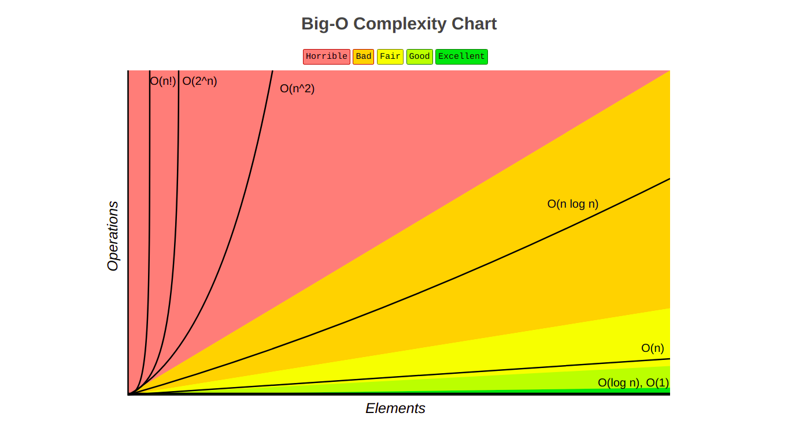
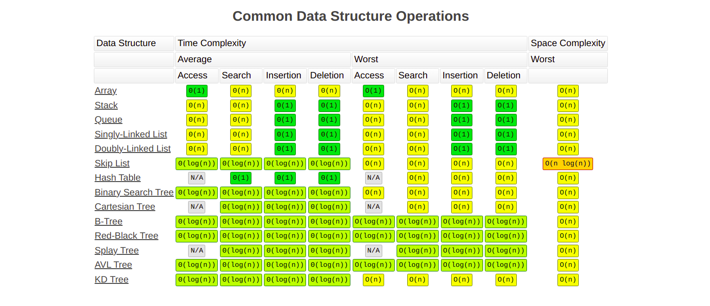
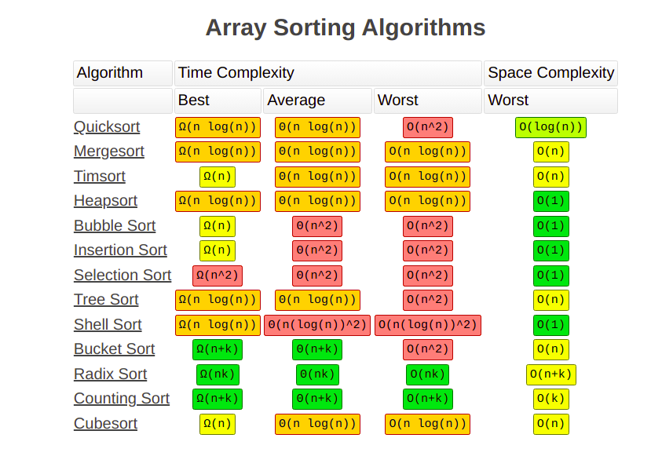

# 🔥 LeetCode DSA Question'S

> This is my Dsa practice repository. I'll try to solve 4 to 5 problem's everyday to keep myself consistent.

# Useful Information.

## Big O Notation

_Big O notation_ is used to classify algorithms according to how their running time or space requirements grow as the input size grows.
On the chart below you may find most common orders of growth of algorithms specified in Big O notation.

Below is the list of some of the most used Big O notations and their performance comparisons against different sizes of the input data.

| Big O Notation | Computations for 10 elements | Computations for 100 elements | Computations for 1000 elements |
| -------------- | ---------------------------- | ----------------------------- | ------------------------------ |
| **O(1)**       | 1                            | 1                             | 1                              |
| **O(log N)**   | 3                            | 6                             | 9                              |
| **O(N)**       | 10                           | 100                           | 1000                           |
| **O(N log N)** | 30                           | 600                           | 9000                           |
| **O(N^2)**     | 100                          | 10000                         | 1000000                        |
| **O(2^N)**     | 1024                         | 1.26e+29                      | 1.07e+301                      |
| **O(N!)**      | 3628800                      | 9.3e+157                      | 4.02e+2567                     |

### Big O Graph Chart

### Data Structure Operations Complexity

### Array Sorting Algorithms Complexity

### Question List

| No. | Questions                                                                                                                                             | Done or Not |
| --- | ----------------------------------------------------------------------------------------------------------------------------------------------------- | ----------- |
| 1   | [Two Sum](https://github.com/rahulpandey70/LeetCode-Questions/blob/master/Solution's/TwoSum.py)                                                       | Done        |
| 2   | [Best Time to Buy and Sell Stock](https://github.com/rahulpandey70/LeetCode-Questions/blob/master/Solution's/StockBuySell.py)                         | Done        |
| 3   | [Contains Duplicate](https://github.com/rahulpandey70/LeetCode-Questions/blob/master/Solution's/ContainsDuplicate.py)                                 | Done        |
| 4   | [Product of Array Except Self](https://github.com/rahulpandey70/LeetCode-Questions/blob/master/Solution's/Productofarrayexceptself.py)                | Done        |
| 5   | [Maximum Subarray](https://github.com/rahulpandey70/LeetCode-Questions/blob/master/Solution's/MaximumSubarray.py)                                     | Done        |
| 6   | [Maximum Product Subarray](https://github.com/rahulpandey70/LeetCode-Questions/blob/master/Solution's/MaximumProductSubarray.py)                      | Done        |
| 7   | [Find Minimum in Rotated Sorted Array](https://github.com/rahulpandey70/LeetCode-Questions/blob/master/Solution's/FindMinimuminRotatedSortedArray.py) | Done        |
| 8   | [Search in Rotated Sorted Array](https://github.com/rahulpandey70/LeetCode-Questions/blob/master/Solution's/SearchinRotatedSortedArray.py)            | Done        |
| 9   | [3Sum](https://github.com/rahulpandey70/LeetCode-Questions/blob/master/Solution's/3Sum.py)                                                            | Done        |
| 10  | [Container With Most Water](https://github.com/rahulpandey70/LeetCode-Questions/blob/master/Solution's/ContainerWithMostWater.py)                     | Done        |
| 11  | [Sum of Two Integers](https://github.com/rahulpandey70/LeetCode-Questions/blob/master/Solution's/SumoftwoIntegers.py)                                 | Done        |
| 12  | [Number of 1 Bits](https://github.com/rahulpandey70/LeetCode-Questions/blob/master/Solution's/Numberof1Bits.py)                                       | Done        |
| 13  | [Counting Bits](https://github.com/rahulpandey70/LeetCode-Questions/blob/master/Solution's/CountingBits.py)                                           | Done        |
| 14  | [Missing Number](https://github.com/rahulpandey70/LeetCode-Questions/blob/master/Solution's/MissingNumber.py)                                         | Done        |
| 15  | [Reverse Bits](https://github.com/rahulpandey70/LeetCode-Questions/blob/master/Solution's/ReverseBits.py)                                             | Done        |
| 16  | [Climbing Stairs](https://github.com/rahulpandey70/LeetCode-Questions/blob/master/Solution's/ClimbingStairs.py)                                       | Done        |
| 17  | [Coin Change](https://github.com/rahulpandey70/LeetCode-Questions/blob/master/Solution's/CoinChange.py)                                               | Done        |
| 18  | [Longest Increasing Subsequence](https://github.com/rahulpandey70/LeetCode-Questions/blob/master/Solution's/LongestIncreasingSubsequence.py)          | Done        |
| 19  | [Longest Common Subsequence](https://github.com/rahulpandey70/LeetCode-Questions/blob/master/Solution's/LongestCommonSubsequence.py)                  | Done        |
| 20  | [Word Break Problem](https://github.com/rahulpandey70/LeetCode-Questions/blob/master/Solution's/WordBreakProblem.py)                                  | Done        |
| 21  | [Combination Sum](https://github.com/rahulpandey70/LeetCode-Questions/blob/master/Solution's/CominationSum.py)                                        | Done        |
| 22  | [House Robber](https://github.com/rahulpandey70/LeetCode-Questions/blob/master/Solution's/HouseRobber.py)                                             | Done        |
| 23  | [House Robber II](https://github.com/rahulpandey70/LeetCode-Questions/blob/master/Solution's/HouseRobber2.py)                                         | Done        |
| 24  | [Decode Ways](https://github.com/rahulpandey70/LeetCode-Questions/blob/master/Solution's/DecodeWays.py)                                               | Done        |
| 25  | [Unique Paths](https://github.com/rahulpandey70/LeetCode-Questions/blob/master/Solution's/UniquePaths.py)                                             | Done        |
| 26  | [Jump Game](https://github.com/rahulpandey70/LeetCode-Questions/blob/master/Solution's/JumpGame.py)                                                   | Done        |
| 27  | [Clone Graph]()                                                                                                                                       |
| 28  | [Course Schedule]()                                                                                                                                   |
| 29  | [Pacific Atlantic Water Flow]()                                                                                                                       |
| 30  | [Number of Islands]()                                                                                                                                 |
| 31  | [Longest Consecutive Sequence]()                                                                                                                      |
| 32  | [Alien Dictionary (Leetcode Premium)]()                                                                                                               |
| 33  | [Graph Valid Tree (Leetcode Premium)]()                                                                                                               |
| 34  | [Number of Connected Components in an Undirected Graph (Leetcode Premium)]()                                                                          |
| 35  | [Insert Interval]()                                                                                                                                   |
| 36  | [Merge Intervals](https://github.com/rahulpandey70/LeetCode-Questions/blob/master/Solution's/mergeIntervals.js)                                       | Done        |
| 37  | [Non-overlapping Intervals]()                                                                                                                         |
| 38  | [Meeting Rooms (Leetcode Premium)]()                                                                                                                  |
| 39  | [Meeting Rooms II (Leetcode Premium)]()                                                                                                               |
| 40  | [Reverse a Linked List](https://github.com/rahulpandey70/LeetCode-Questions/blob/master/Solution's/ReverseaLinkedList.py)                             | Done        |
| 41  | [Detect Cycle in a Linked List](https://github.com/rahulpandey70/LeetCode-Questions/blob/master/Solution's/DetectCycleInaLinkedList.py)               | Done        |
| 42  | [Merge Two Sorted Lists](https://github.com/rahulpandey70/LeetCode-Questions/blob/master/Solution's/MergeTwoSortedList.py)                            | Done        |
| 43  | [Merge K Sorted Lists]()                                                                                                                              |
| 44  | [Remove Nth Node From End Of List](https://github.com/rahulpandey70/LeetCode-Questions/blob/master/Solution's/RemoveNthNodeFromEndOfList.py)          | Done        |
| 45  | [Reorder List]()                                                                                                                                      |
| 46  | [Set Matrix Zeroes]()                                                                                                                                 |
| 47  | [Spiral Matrix]()                                                                                                                                     |
| 48  | [Rotate Image]()                                                                                                                                      |
| 49  | [Word Search]()                                                                                                                                       |
| 50  | [Longest Substring Without Repeating Characters]()                                                                                                    |
| 51  | [Longest Repeating Character Replacement]()                                                                                                           |
| 52  | [Minimum Window Substring]()                                                                                                                          |
| 53  | [Valid Anagram]()                                                                                                                                     |
| 54  | [Group Anagrams]()                                                                                                                                    |
| 55  | [Valid Parentheses]()                                                                                                                                 |
| 56  | [Valid Palindrome]()                                                                                                                                  |
| 57  | [Longest Palindromic Substring]()                                                                                                                     |
| 58  | [Palindromic Substrings]()                                                                                                                            |
| 59  | [Encode and Decode Strings (Leetcode Premium)]()                                                                                                      |
| 60  | [Maximum Depth of Binary Tree]()                                                                                                                      |
| 61  | [Same Tree]()                                                                                                                                         |
| 62  | [Invert/Flip Binary Tree]()                                                                                                                           |
| 63  | [Binary Tree Maximum Path Sum]()                                                                                                                      |
| 64  | [Binary Tree Level Order Traversal]()                                                                                                                 |
| 65  | [Serialize and Deserialize Binary Tree]()                                                                                                             |
| 66  | [Subtree of Another Tree]()                                                                                                                           |
| 67  | [Construct Binary Tree from Preorder and Inorder Traversal]()                                                                                         |
| 68  | [Validate Binary Search Tree]()                                                                                                                       |
| 69  | [Kth Smallest Element in a BST]()                                                                                                                     |
| 70  | [Lowest Common Ancestor of BST]()                                                                                                                     |
| 71  | [Implement Trie (Prefix Tree)]()                                                                                                                      |
| 72  | [Add and Search Word]()                                                                                                                               |
| 73  | [Word Search II]()                                                                                                                                    |
| 74  | [Top K Frequent Elements]()                                                                                                                           |
| 75  | [Find Median from Data Stream]()                                                                                                                      |
| 76  | [Add Two Numbers](https://github.com/rahulpandey70/LeetCode-Questions/blob/master/Solution's/AddTwoNumbers.py)                                        | Done        |
| 77  | [Median of two Sorted Arrays](https://github.com/rahulpandey70/LeetCode-Questions/blob/master/Solution's/MedianOfTwoSortedArray.py)                   | Done        |
| 78  | [ZigZag Conversion](https://github.com/rahulpandey70/LeetCode-Questions/blob/master/Solution's/ZigZagConversion.py)                                   | Done        |
| 79  | [Reverse Integer](https://github.com/rahulpandey70/LeetCode-Questions/blob/master/Solution's/ReverseInteger.py)                                       | Done        |
| 80  | [Search a 2D Matrix](https://github.com/rahulpandey70/LeetCode-Questions/blob/master/Solution's/SearchA2DMatrix.py)                                   | Done        |
| 81  | [Search a 2D Matrix 2](https://github.com/rahulpandey70/LeetCode-Questions/blob/master/Solution's/SearchA2DMatrix2.py)                                | Done        |
| 82  | [Find in Mountain Array](https://github.com/rahulpandey70/LeetCode-Questions/blob/master/Solution's/FindInMountainArray.py)                           | Done        |
| 83  | [Find Peak Element](https://github.com/rahulpandey70/LeetCode-Questions/blob/master/Solution's/FindPeakElement.py)                                    | Done        |

    <b><a href="#">back to top</a></b>

